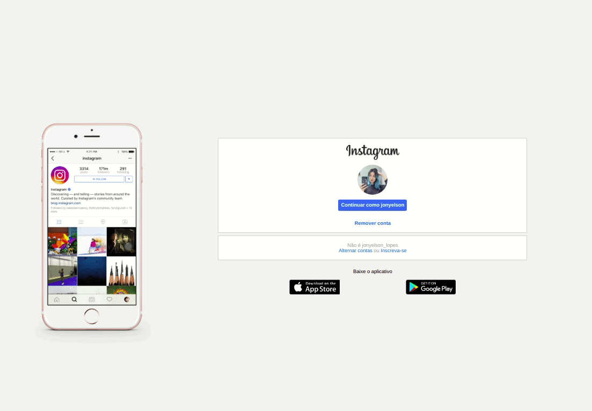

<h1> 

</h1>


# Clone da Interface do Instagram

## 📝Sobre
Este projeto visa a utilização do Flexbox , na qual vamos fazer a interface de login do Instagram! 

## 🚀Tecnologias utilizadas

* [HTML básico](https://www.w3schools.com/html/)
* [CSS básico](https://developer.mozilla.org/pt-BR/docs/Web/CSS)

## 📦Como baixar o projeto
```bash
# Clonar o repositório
$ git clone https://github.com/JL-Sousa/clone-instagram.git

# Entrar no diretório
$ cd home-instagram

# Iniciar o projeto
abra o arquivo index.html no browser
```

---
🔥Desenvolvido com❤️ por \***\*_Jonyelson Lopes_\*\***